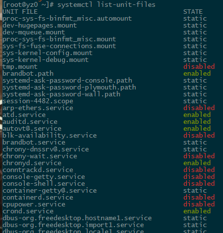

# 系统中状态为 static 的服务

最近开始接触 Linux 运维的工作，第一件事情就是看看系统中跑了多少服务。

<!-- truncate -->

集群用的是 CentOS 7，可以通过 ```bash systemctl list-unit-files``` 这个命令查看所有服务，敲下回车后打印出来这么一堆玩应儿：



service 的 `disabled` 和 `enabled` 状态都好理解，`static` 是个啥？在[不存在的网站][1]上一顿查找，找到如下这番解释：

> "static" means "enabled because something else wants it". Think by analogy to pacman's package install reasons:
>
> - enabled :: explicitly installed
> - static :: installed as dependency
> - disabled :: not installed

意思是，状态为 `static` 的服务，是作为别的服务的依赖而存在。

[1]: https://bbs.archlinux.org/viewtopic.php?id=147964 "systemd 'static' unit file state"
